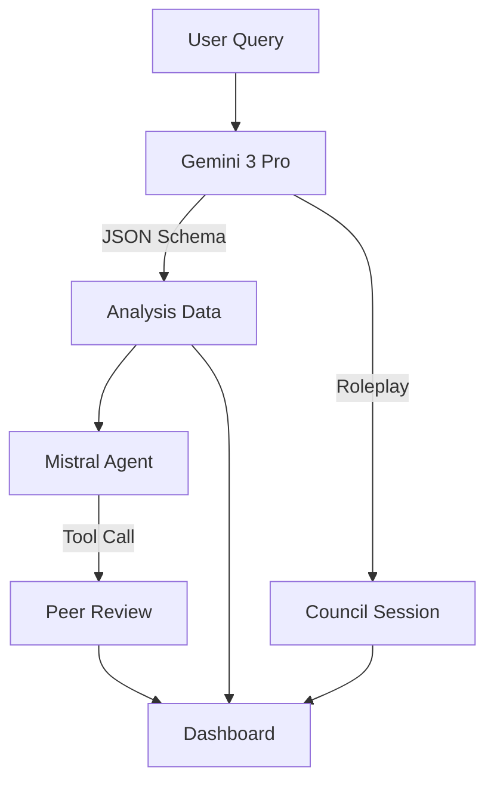

# System Architecture: The BiblioNexus Core

## 1. The Dual-Agent Consensus Model

BiblioNexus avoids the "Single Point of Failure" common in LLM apps by employing a **Generative-Adversarial** style loop, though cooperative rather than competitive.

### The Pipeline
1.  **User Query:** Input (e.g., "The Melchizedek Priesthood").
2.  **Primary Inference (Gemini 3 Pro):**
    *   Generates the `AnalysisData` JSON.
    *   Constructs the "Council Session" (Roleplay between Archaeologist, Theologian, Mystic).
    *   Generates visual data (Coordinates, Timeline, DNA sequences).
3.  **Secondary Review (Mistral Large / Agent):**
    *   Ingests the `AnalysisData`.
    *   Runs the **"Theological Gardener"** protocol.
    *   Calculates `agreement_score` (0-100).
    *   Flags "Missed Citations" and "Divergent Points".
4.  **Frontend Synthesis:** React merges both streams to display the Dashboard and the Peer Review Panel.

## 2. Data Structures (The Schema)

We enforce strict typing via `types.ts` to ensure the "fluid" nature of Scripture is captured in rigid, renderable data structures.

*   **`CrossReference`**: Not just a link, but a directional vector (`Prophecy` vs `Fulfillment`).
*   **`BioTheology`**: Abstract concepts mapped to `AGCT` nucleotides for sequencing visualization.
*   **`ChronoSpatial`**: Geospatial data keyed by `HistoricalEra` to enable 4D sliding.

## 3. Visualization Physics

### Network Graph (Force-Directed)
*   **Engine:** D3.js `forceSimulation`.
*   **Physics:** High negative charge (`forceManyBody: -1500`) to create "cosmic spacing."
*   **Clustering:** Bezier curves (`path Q`) are used for multi-edges to visualize complex relationships without overlap.

### Prophetic Arcs (Trajectory)
*   **Mapping:** We map the 66 books of the Bible to a linear 0-100 x-axis.
*   **Precision:** We use `Book Index + (Chapter / TotalChapters)` to calculate exact pixel coordinates for start/end points.
*   **Aesthetics:** Gold (OT) to Indigo (NT) gradients represent the transition from Shadow to Substance.

## 4. State Management
*   Currently using localized React State (`useState`, `useReducer`).
*   **Future:** Migration to `Zustand` or `Context API` is recommended as the "Council" features grow more complex.
